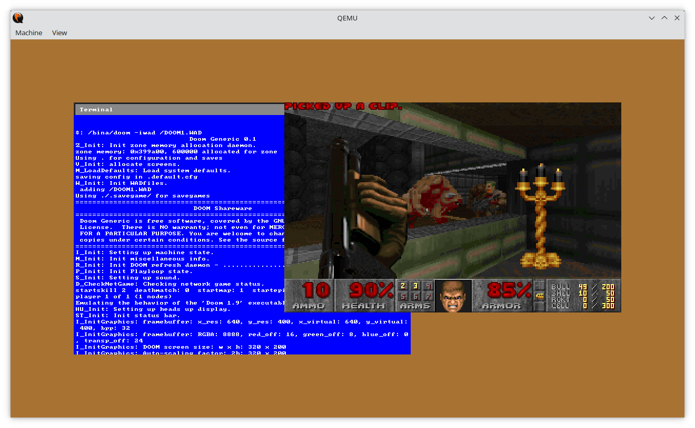

# pi0-os

A fully from scratch operating system for the ~~Raspberry Pi Zero~~ QEMU "virt" machine.
Still need to find a good name for it.

## How to try it out

The easiest way to try it out is to install `qemu-system-arm`, download a package
from the CI pipeline and run the script inside it.

## Build instructions

There is a Docker image that can be used to build the project.
You cannot use it to run QEMU though, so you'll have to install `qemu-system-arm`
separately outside of it, and also `make`.

To build using Docker, run the following commands:

```
docker build -t pi0-os .
docker run -v $(pwd):/pi0-os pi0-os
```

This will build the kernel, all of the userland programs and automatically create a disk image


**Build instructions:**

## With Docker

```
docker build -t pi0-os .
docker run -v $(pwd):/pi0-os pi0-os
```

1. Install `arm-none-eabi-gcc` and `qemu-system-arm`
2. Run `make qemu`

I am working on a large refactor to add support for more boards,
especially the QEMU virt machine (still ARM) and mostly to move away from
ARMv6 into ARMv7.

There's barely a GUI or any usable software, but you can run DOOM:

